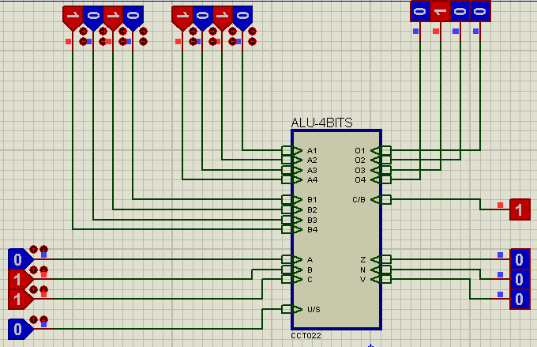
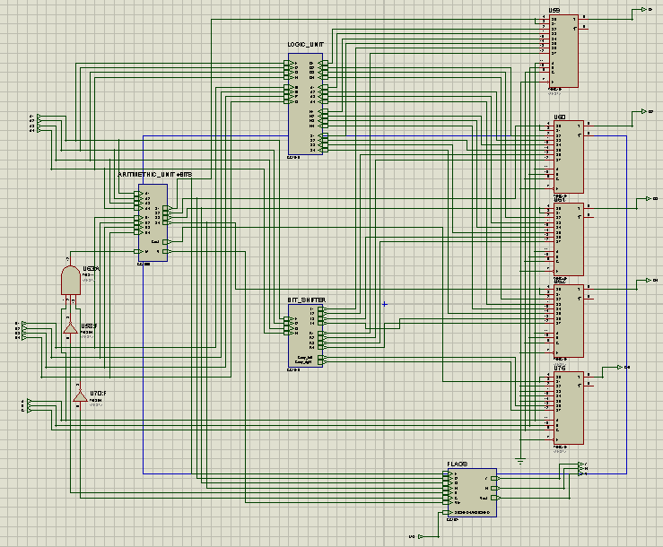

# Unidade Lógica Aritmética (ALU)

Projeto de uma Unidade Lógica Aritmética (ALU) de 4 bits implementada inteiramente com portas lógicas e circuitos digitais, sem a utilização de microcontroladores ou programação. O desenvolvimento e a simulação foram realizados no **Proteus 7**.

A ALU executa operações aritméticas e lógicas, como soma, subtração, AND, OR, XOR, NOT e deslocamentos de bits. Também implementa as flags **Carry (C)**, **Zero (Z)**, **Negative (N)** e **Overflow (V)**, além de um modo de operação **Signed/Unsigned**, permitindo o tratamento adequado de números com e sem sinal.

## Especificações

- Arquitetura: 4 bits
- Operações: 8
- Modo de operação: Signed e Unsigned
- Flags: Carry/Borrow, Zero, Negative e Overflow

## Demonstração

## Arquitetura

O projeto foi desenvolvido de forma modular, utilizando componentes independentes para cada bloco funcional da ALU, incluindo:

- Unidade Aritmética 4 bits
  - Somador completo de 1 bit
  - Somador de 4 bits
  - Unidade de complemento de dois
- Unidade lógica (AND, OR, XOR e NOT)
- Unidade de deslocamento (Shift Left e Shift Right)
- Multiplexadores para seleção das operações
- Circuito de geração das flags

# Funcionalidades
> **Código** refere-se às entradas **CBA**, responsáveis pela seleção da operação executada pela ALU.

| Código | Operação    |
| :----: | ----------- |
|  `000` | Soma        |
|  `001` | Subtração   |
|  `010` | OR          |
|  `011` | AND         |
|  `100` | NOT         |
|  `101` | XOR         |
|  `110` | Shift Left  |
|  `111` | Shift Right |

## Flags

| Flag | Descrição |
|:----:|-----------|
| **C/B** | Carry na soma, Borrow na subtração (Modo Unsigned) e bit deslocado nas operações de Shift. |
| **Z** | Ativada quando o resultado da operação é igual a zero. |
| **N** | Indica resultado negativo em operações no modo Signed. |
| **V** | Indica overflow em operações aritméticas no modo Signed. |

## Signed/Unsigned

A ALU possui um bit de seleção que permite operar em modo **Signed** ou **Unsigned**.

- **Signed:** utiliza as flags **N**, **Z** e **V** para interpretação dos resultados.
- **Unsigned:** utiliza as flags **C** e **Z**, desconsiderando as flags **N** e **V**.
 
## Ferramentas Utilizadas

- Proteus 7
- Circuitos Integrados da família 74HC/74LS
- Lógica Digital Combinacional

## Entradas e Saídas

> Use isso caso queira Testar o Circuito
### Entradas

| Sinal | Descrição |
|-------|-----------|
| A[3:0] | Operando A |
| B[3:0] | Operando B |
| CBA | Seleção da operação |
| S/U | Seleção Signed/Unsigned |

### Saídas

| Sinal | Descrição |
|-------|-----------|
| F[3:0] | Resultado |
| C/B | Carry ou Borrow |
| Z | Zero |
| N | Negative |
| V | Overflow |

## Aprendizados

Durante o desenvolvimento deste projeto foram estudados e aplicados conceitos de:

- Álgebra Booleana.
- Lógica combinacional.
- Projeto modular de circuitos digitais.
- Arquitetura e funcionamento de uma Unidade Lógica Aritmética (ALU).
- Representação de números em complemento de dois.
- Operações aritméticas com e sem sinal (Signed/Unsigned).
- Detecção de overflow e geração de flags de estado.
- Propagação de carry em somadores de múltiplos bits.
- Projeto e depuração de circuitos digitais utilizando o Proteus 7.

## 📄 Licença

Este projeto está licenciado sob a Licença MIT. Consulte o arquivo [LICENSE](LICENSE) para mais informações.

